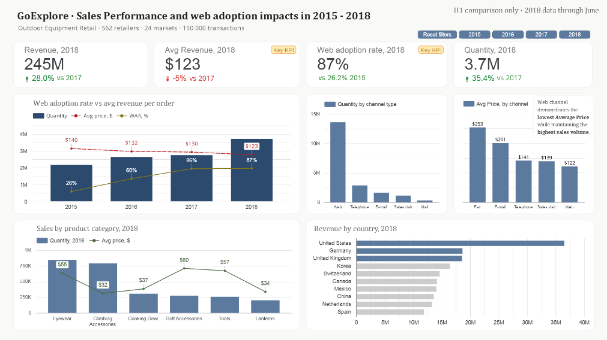

# 📊 Sales & Channel Performance Analysis

## 🧭 Overview

This project analyses sales performance across multiple channels and markets between 2015 and 2018.
The goal is to understand how digital adoption (web channel) impacts revenue, pricing, and sales volume.
This is my first dashboard as part of the Data Analytics educational course.

---

## 🎯 Business Problem

The company is experiencing growth in sales volume, but there are changes in average order value and channel distribution.

Key questions:

* How does web adoption affect revenue and pricing?
* Which channels drive the most sales?
* What are the main revenue drivers across countries and product categories?

---

## 📈 Key Insights

* Web adoption increased significantly from **26% in 2015 to 87% in 2018**
* Total revenue grew to **$245M (+28% YoY)**
* Sales volume increased, while **average price decreased**
* Web channel drives the highest quantity but has lower average price compared to offline channels
* The United States is the dominant market, generating the highest share of revenue
* Product categories show different pricing strategies, with some categories having high volume but low price

---

## 📊 Dashboard

---

## 🧠 Analysis Approach

* Aggregated sales data by year, channel, country, and product category
* Compared trends over time (2015–2018)
* Analyzed relationships between:

  * Web adoption rate
  * Average price
  * Sales volume
* Identified key drivers of revenue growth

---

## 🛠 Tools Used

* Power BI / Tableau (data visualization)
* SQL (data extraction and transformation) *(if applicable)*
* Excel / CSV (data source)

---

## 📁 Data

* Dataset includes:

  * Sales transactions (~150,000 records)
  * 24 markets
  * 562 retailers
* Data is anonymized and used for educational purposes

---

## 🚀 What I Would Improve

* Add profit/margin analysis to better evaluate business performance
* Include customer segmentation (new vs returning)
* Build interactive filters for deeper exploration
* Simplify some visualizations to improve readability

---

## 📌 Conclusion

The analysis shows that digital channels (web) are a key driver of growth, increasing sales volume but putting pressure on pricing.
Understanding this trade-off is critical for optimizing channel strategy and maximizing revenue.
